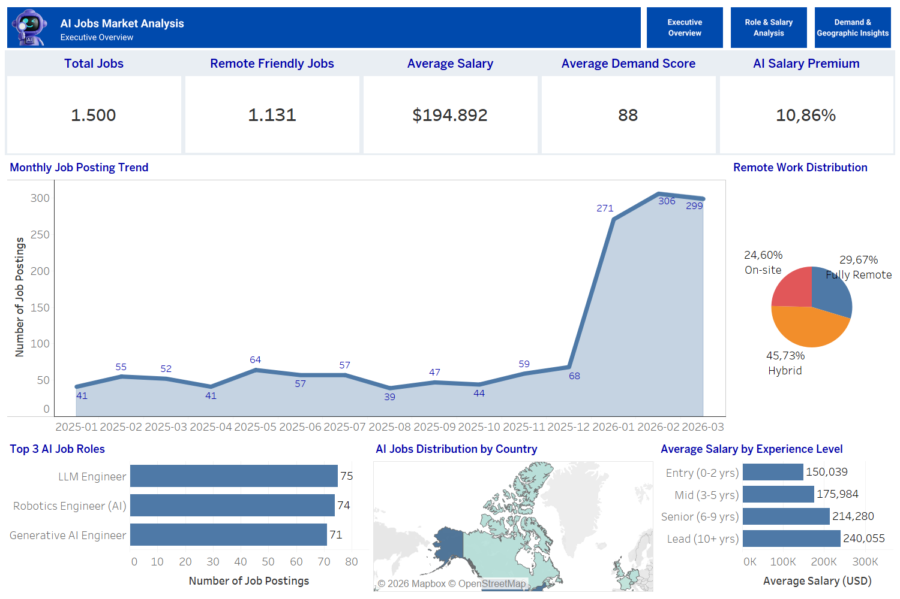
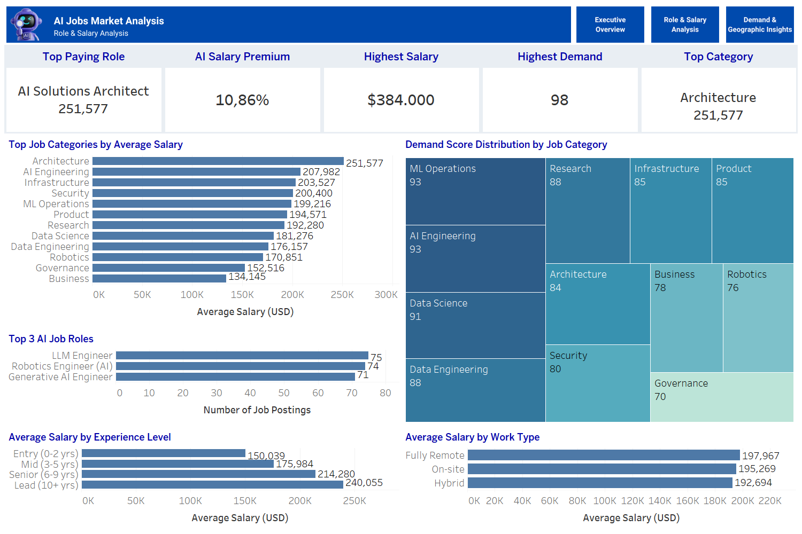
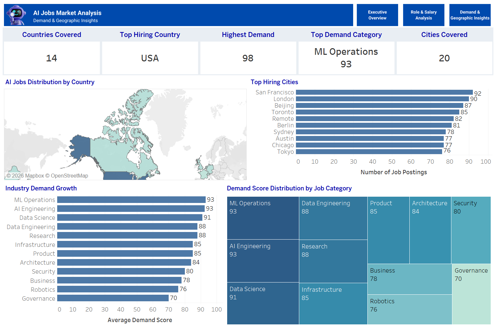

# AI Jobs Market Analysis Dashboard

An interactive Tableau dashboard that analyzes the AI Jobs Market dataset (2025–2026). This project provides insights into AI job trends, salary distribution, market demand, geographic hiring patterns, and remote work opportunities through interactive visualizations.

---

## Project Overview

The dashboard is designed to help users understand the current AI job market by exploring:

- Overall job market statistics
- Salary analysis by category, experience, and work type
- AI job demand across industries
- Geographic distribution of AI job postings
- Remote work opportunities
- Monthly hiring trends

---

## Dataset Information

| Information | Value |
|-------------|-------|
| Dataset | AI Jobs Market 2025–2026 |
| Total Records | 1,500 |
| Total Columns | 25 |
| Missing Values | 0 |
| Duplicate Records | 0 |

---

## Dashboard Pages

### 1. Executive Overview

Provides a high-level summary of the AI job market.

**Key Visualizations**

- Total Jobs
- Remote Friendly Jobs
- Average Salary
- Average Demand Score
- AI Salary Premium
- Monthly Job Posting Trend
- Remote Work Distribution
- Top AI Job Roles
- AI Jobs Distribution by Country
- Average Salary by Experience Level

---

### 2. Role & Salary Analysis

Focuses on salary trends and job roles.

**Key Visualizations**

- Top Paying Role
- AI Salary Premium
- Highest Salary
- Highest Demand
- Top Category
- Average Salary by Job Category
- Top AI Job Roles
- Demand Score Distribution
- Average Salary by Experience Level
- Average Salary by Work Type

---

### 3. Demand & Geographic Insights

Analyzes demand growth and geographic distribution.

**Key Visualizations**

- Countries Covered
- Top Hiring Country
- Highest Demand
- Top Demand Category
- Cities Covered
- AI Jobs Distribution by Country
- Top Hiring Cities
- Industry Demand Growth
- Demand Score Distribution by Job Category

---

## Tools Used

- Tableau Desktop
- Microsoft Excel
- GitHub

---

## Folder Structure

```text
AI-Jobs-Market-Analysis/
├── Dashboard/
│   └── AI_Jobs_Market_Analysis.twbx
├── Dataset/
│   └── ai_jobs_market_2025_2026.csv
├── Images/
│   ├── Executive_Overview.png
│   ├── Role_Salary_Analysis.png
│   └── Demand_Geographic_Insights.png
└── README.md
```

---

## Dashboard Preview

### Executive Overview



---

### Role & Salary Analysis



---

### Demand & Geographic Insights



---

## Key Insights

- The dataset contains **1,500 AI job postings** across multiple countries.
- The United States is the leading country for AI hiring.
- AI Architecture and AI Engineering offer the highest average salaries.
- Demand scores vary across AI specializations, with ML Operations and AI Engineering showing the strongest demand.
- Hybrid and Fully Remote work models represent a significant portion of AI job opportunities.
- Salary generally increases with higher experience levels.

---

## Authors

- **Ragil Yudi Saputra**
- **Edgina Rangga Arkananta**

**Information Systems**

**Universitas Harapan Bangsa**

---

## License

This project was created for educational purposes as part of the Data Visualization course using Tableau.
